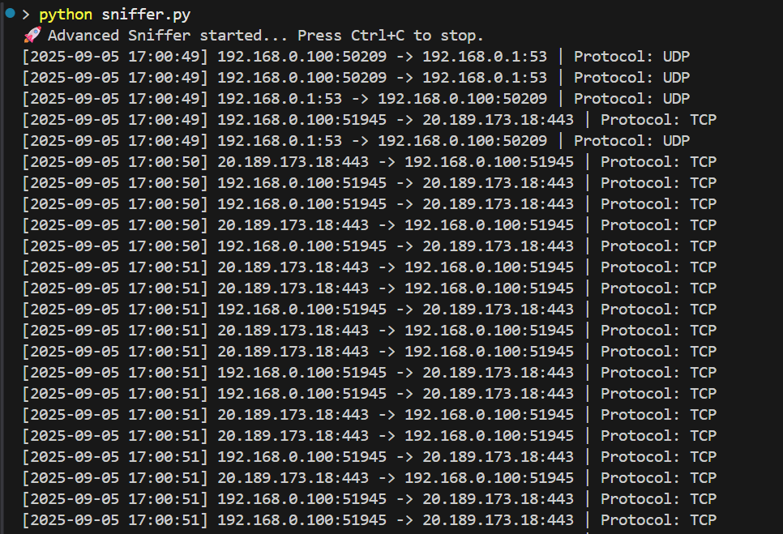

# CodeAlpha_Basic-Network-Sniffer
Basic Network Sniffer project for CodeAlpha Cybersecurity Internship — captures and analyzes live packets using Python and Scapy.

# CodeAlpha Cybersecurity Internship - Task 1

## 📌 Project: Basic Network Sniffer

This project is part of my **CodeAlpha Cybersecurity Internship (September 2025)**.  
The goal of this task is to build a **basic network sniffer in Python** to capture and analyze live packets.

---

## 🛠️ Features
- Captures live network packets.
- Displays **source IP, destination IP, protocol, and ports**.
- Helps understand how data flows in a network.
- Built using the `scapy` library.

---

## 📂 File
- **sniffer.py** → Python script for packet sniffing.

---

## ⚙️ Requirements
- Python 3.8+
- Install dependencies:
  ```bash
  pip install scapy


## 📸 Sample Output

